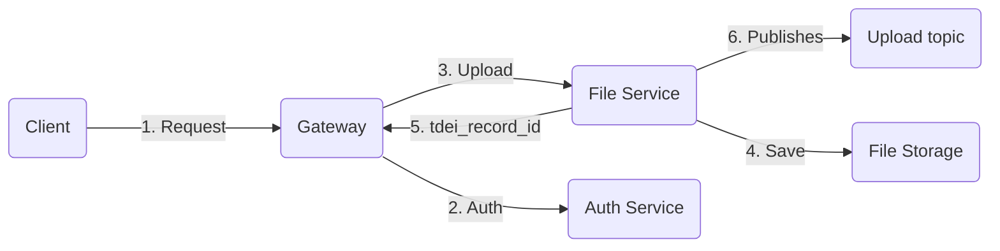

# Introduction

This is an API for file service operations for TDEI system. This API
supports file uploads of GTFS-Pathways, GTFS-Flex v2 and OpenSidewalks
data.

### File Service workflow



1. The client makes the HTTP POST call to the gateway to upload the specific file type. As
   per [Gateway API Doc](https://tdei-gateway-dev.azurewebsites.net/swagger-ui/index.html#/) client uploads the file
   along with metadata information. Example metadata below:

Ex.

``` 
Multipart request will contain two information, one file stream and other metadata information

{ file : octate-stream }
__________________________________
"metadata" :
{
  "tdei_org_id": "dedd49bd-f225-45d5-8523-b819dcc2c648",
  "tdei_station_id": "791a89f4-132f-4224-a837-afc77b5dff7f",
  "collected_by": "testuser",
  "collection_date": "2023-03-02T04:22:42.493Z",
  "collection_method": "manual",
  "valid_from": "2023-04-02T04:22:42.493Z",
  "valid_to": "2023-04-03T04:02:42.493Z",
  "data_source": "TDEITools",
  "polygon": {}, //valid polygon
  "pathways_schema_version": "v1.0"
}
``` 

2. The Gateway authenticates and authorises the upload request by the client against the Auth service.
   Gateway responds back to the client with an unauthorised request if the authorization is unsuccessful.
3. Upon successful authentication and authorization, the Gateway redirects the request to the file service for uploading
   the file.
4. The file service validates the provided metadata information, and upon successful metadata validation, the file gets
   persisted to the Azure blob storage under the per file type container (folder).

- Metadata validation is described in detail [here](./metadata-validation.md)
- Metadata static validation happens at the file service.
- Metadata data validation happens at the data service.

5. Upon successful upload, the "File Service" returns the unique system generated tdei_record_id as a response to **
   Gateway**.

6. In addition, File Service generates the payload with filePath and meta information and pushes the information to
   the topic `upload-topic`.

Ex.

```js
{
  filePath : blob\gtfs-pathways\test-2022-08-08.zip,
  tdei_record_id: "a4820e1a68394ba9b1714436de70ee1d"
  metadata :
  {
    validFrom : XXXX,
    validTo : XXXX
    .....
  }
}
```

## System requirements

| Software | Version |
|----------|---------|
| Java     | 17      |
| Maven    | > 3     |
| Spring   | 2.7.4   |

## Development IDE tool preference

Eclipse (https://www.eclipse.org/downloads/)

Intellij (https://www.jetbrains.com/idea/download)

## Dependencies

Other third-party dependencies used in the project please browse the Maven pom.xml file for details of libraries and
versions used.

## Cloning the project

Clone the project from source controller

```aidl
$ git clone https://TDEI-UW@dev.azure.com/TDEI-UW/TDEI/_git/file-service
```

## Secrets

Application secrets are not included in the code repository. File service relies on below-mentioned environment variable

| Environment Variable                       | Description                                        |
|--------------------------------------------|----------------------------------------------------|
| GTFS_FLEX_CONTAINER_NAME                   | Name of the blob container to upload file          |
| GTFS_FLEX_UPLOAD_ALLOWED_EXTENSIONS        | File extension allowed for upload. comma separated |
| GTFS_FLEX_UPLOAD_TOPIC_NAME                | Name of the upload topic to publish message        |
| GTFS_PATHWAYS_CONTAINER_NAME               | Name of the blob container to upload file          |
| GTFS_PATHWAYS_UPLOAD_ALLOWED_EXTENSIONS    | File extension allowed for upload. comma separated |
| GTFS_PATHWAYS_UPLOAD_TOPIC_NAME            | Name of the upload topic to publish message        |
| OSW_CONTAINER_NAME                         | Name of the blob container to upload file          |
| OSW_UPLOAD_ALLOWED_EXTENSIONS              | File extension allowed for upload. comma separated |
| OSW_UPLOAD_TOPIC_NAME                      | Name of the upload topic to publish message        |
| CLOUD_AZURE_STORAGE_BLOB_CONNECTION_STRING | Azure storage connection string                    |
| CLOUD_AZURE_SERVICE_BUS_CONNECTION_STRING  | Azure service bus connection string                |

## Secrets

Application secrets are not included in the code repository. Below are the instruction for each environment

###### DEV

Create **developer-local-properties.yaml** file under root of `resource` folder and override the application.yaml
placeholders.

```src/main/resources/developer-local-properties.yaml```

###### PROD

Secrets are configured as an environment variables on the deployment server.

## Building the project

### IDE

Import the project in your preferred IDE by selecting POM.xml.

### Cli

*Note: Navigate to the cloned repository directory before proceeding for below steps

### 1. Building the server

Use Maven command to build the server. Below mvn command will

1. Cleans the project and removes all files generated by the previous build
2. Builds the maven project and generates the jar package to target directory

```
$ mvn clean install
```

### 2. Running the server

```
$ cd target
$ java -jar -Dspring.profiles.active=dev filesvc-0.0.1.jar
```

### 3. Browse API documentation

Navigate to the below link for API documentation and API playground

http://localhost:8080/swagger-ui/index.html

## Running the test

- Uncomment the below line of code from Pom.xml.

  ```<maven.test.skip>true</maven.test.skip>```

- Run mvn command

```
$ mvn test
```

Development API documentation link

https://tdei-filesvc.azurewebsites.net/swagger-ui/index.html
