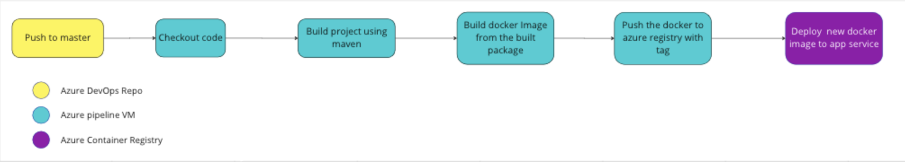

# Introduction

This is an API for file service operations for TDEI system. This API
supports file uploads of GTFS-Pathways, GTFS-Flex v2 and OpenSidewalks
data.

## System requirements

| Software | Version |
|----------|---------|
| Java     | 17      |
| Maven    | > 3     |
| Spring   | 2.7.4   |

## Development IDE tool preference

Eclipse (https://www.eclipse.org/downloads/)

Intellij (https://www.jetbrains.com/idea/download)

## Dependencies

Other third-party dependencies used in the project please browse the Maven pom.xml file for details of libraries and
versions used.

## Cloning the project

Clone the project from source controller

```aidl
$ git clone https://TDEI-UW@dev.azure.com/TDEI-UW/TDEI/_git/file-service
```

## Secrets

Application secrets are not included in the code repository. Below are the instruction for each environment

###### Local

Request for **developer-local-properties.yaml** file from Admin, which should be copied to below location

```src/main/resources/developer-local-properties.yaml```

###### DEV/PROD

Required properties will be set as an environment variables on the deployment environment.

        CLOUD_AZURE_STORAGE_BLOB_ACCOUNT_KEY
        CLOUD_AZURE_STORAGE_BLOB_CONNECTION_STRING
        CLOUD_AZURE_SERVICE_BUS_CONNECTION_STRING

## Building the project

### IDE

Import the project in your preferred IDE by selecting POM.xml.

### Cli

*Note: Navigate to the cloned repository directory before proceeding for below steps

### 1. Building the server

Use Maven command to build the server. Below mvn command will

1. Cleans the project and removes all files generated by the previous build
2. Builds the maven project and generates the jar package to target directory

```
$ mvn clean install
```

### 2. Running the server

```
$ cd target
$ java -jar -Dspring.profiles.active=dev filesvc-0.0.1.jar
```

### 3. Browse API documentation

Navigate to the below link for API documentation and API playground

http://localhost:8080/swagger-ui/index.html

## Running the test

- Uncomment the below line of code from Pom.xml.

  ```<maven.test.skip>true</maven.test.skip>```

- Run mvn command

```
$ mvn test
```

## CI/CD [Azure Pipeline]

### Continuous Integration (CI)

Currently, CI is not implemented as part of Azure pipeline. Test automated integration will be taken up in next
development cycle.

### Continuous Deployment (CD)

Check-in to the master branch triggers the Azure pipeline [gateway] CI/CD process which will build the source code,
generate the package and create the docker image. Docker image will then be deployed to Azure app services.

Process Flow Diagram:



Development API documentation link

https://tdei-filesvc.azurewebsites.net/swagger-ui/index.html
